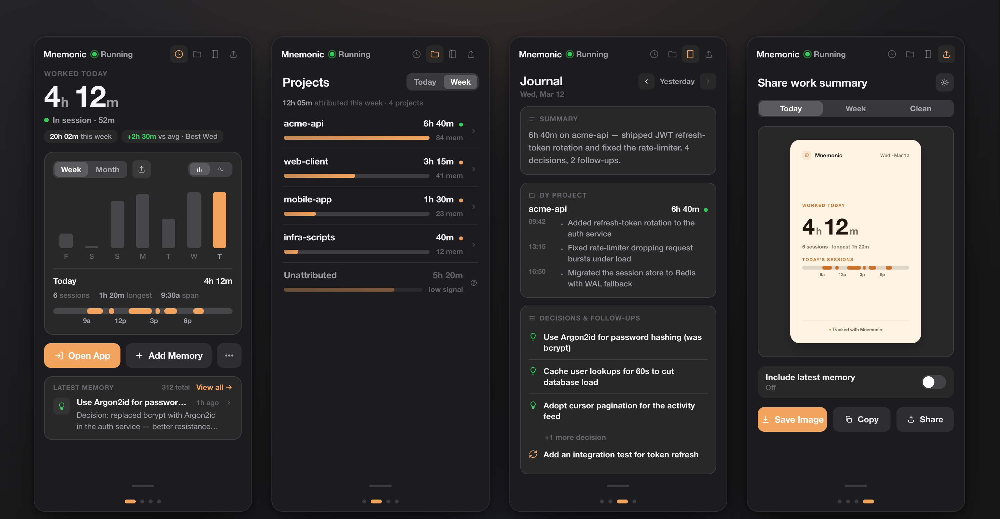
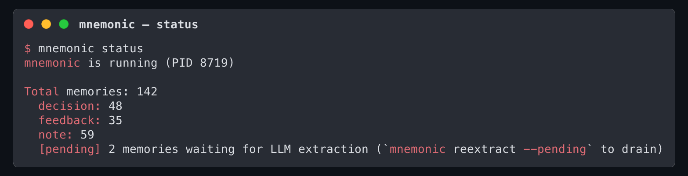
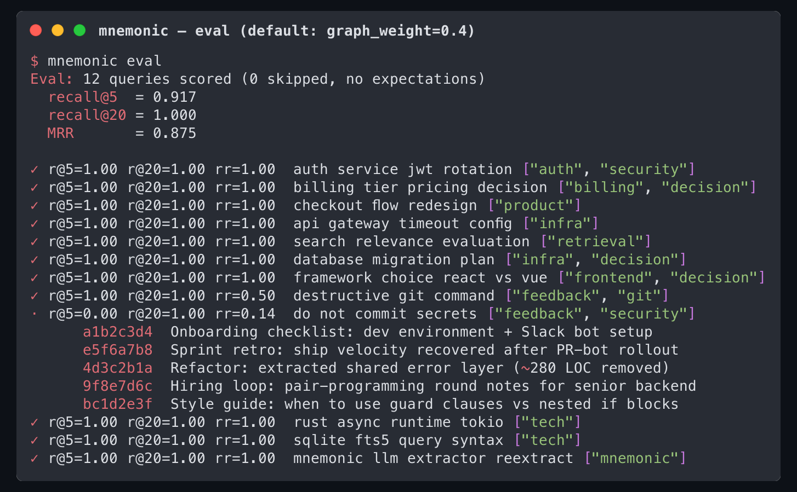
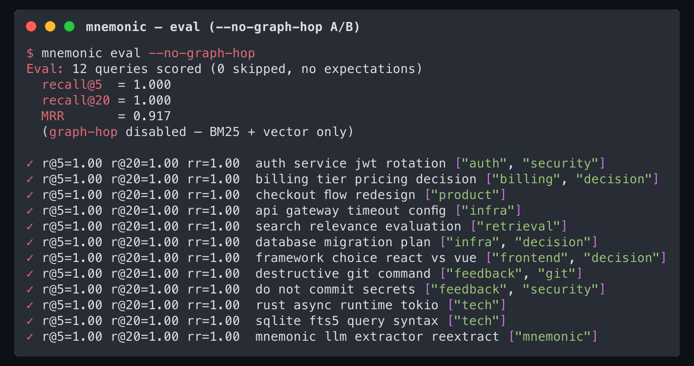

<p align="center">
  
</p>

<p align="center">
  <a href="https://github.com/kossvat/mnemonic/actions"></a>
  <a href="https://github.com/kossvat/mnemonic/releases"></a>
  <a href="LICENSE"></a>
</p>

<p align="center">
  <b>Background memory daemon for AI coding agents.</b><br>
  Watches your project, captures decisions, and builds persistent memory — automatically.<br>
  <sub>Local-first · no telemetry · no API keys for the local path.</sub>
</p>

<p align="center">
  
</p>
<p align="center">
  <sub>The menu-bar widget — worked time, per-project hours, and a readable daily journal.<br>(Demo data shown.)</sub>
</p>

---

> Your AI agent forgets everything between sessions. You make an architectural call, fix a
> subtle bug, correct the agent's approach — and tomorrow it starts from a blank slate.
> **Mnemonic runs in the background, captures all of that as it happens, and feeds it back
> to your agent on the next session.** No manual "save this to memory" — it just remembers.

## Contents

- [Why mnemonic?](#why-mnemonic)
- [Features at a glance](#features-at-a-glance)
- [Requirements](#requirements)
- [Quick start](#quick-start)
- [Menu-bar widget](#menu-bar-widget)
- [Day-to-day operations](#day-to-day-operations)
- [How it works](#how-it-works)
- [CLI reference](#cli-reference)
- [Configuration](#configuration)
- [Security & Privacy](#security--privacy)
- [Data storage](#data-storage)
- [Roadmap](#roadmap)
- [Building](#building)
- [License](#license)

## Why mnemonic?

Existing agent-memory tools make *you* do the work: you have to remember to save the right
thing, tag it, and hope it surfaces later. In practice the important context — the *why*
behind a decision, the correction you gave at 2am — is exactly what never gets saved.

Mnemonic flips that. It watches your actual work and captures memory **automatically**:

- **Git commits** — classified by conventional-commit type (`feat` → decision, `fix` → note)
- **File changes** — new files, dependency additions, significant modifications
- **User corrections** — when you override an agent's approach (highest priority, never discarded)
- **Live conversations** — monitors Claude Code and Codex CLI sessions for decisions and corrections in real time
- **Knowledge graph** — extracts entities (projects, tech, modules) and how they relate

Git, file-change, and correction capture is **agent-agnostic** — it watches the filesystem and git, so work done with Codex, Cursor, or a plain editor is captured just the same. Live *transcript* watching now covers both Claude Code and Codex CLI sessions.

Everything is deduplicated, scored for importance, and stored **locally** in four places (the
last two optional):

1. **SQLite** — FTS5 full-text search + semantic embeddings + knowledge graph
2. **Claude Code memory files** — your agent sees the memories on session start
3. **Obsidian vault** — human-readable notes with tags and frontmatter
4. **Memory API** — sync to a shared API for cross-agent access

## Features at a glance

| | |
|---|---|
| 🪄 **Automatic capture** | Git, file changes, corrections, and live Claude Code sessions — zero manual saving |
| 🔒 **Local-first** | SQLite on your machine. No telemetry, no API keys for the local path — [audited](#security--privacy) |
| 🔎 **Semantic search** | Neural embeddings + HNSW index, hybrid FTS5 + vector retrieval, optional reranker |
| 🕸️ **Knowledge graph** | Extracts projects / tech / people and their relationships from your memories |
| 🤝 **Agent-agnostic** | MCP server (7 tools) works with any MCP client — Claude Code, Codex, Cursor; Claude Code also gets `SessionStart` auto-context |
| 📊 **Menu-bar widget** | macOS SwiftUI app: worked time, per-project hours, and a readable daily journal |
| 📈 **Measurable** | `mnemonic eval` reports recall@5 / recall@20 / MRR — tune retrieval, don't vibe-check it |

## Requirements

- **Rust 1.70+** — for building from source
- **Git** — for commit tracking (optional, works without it)
- **macOS or Linux** — Windows not yet supported

**Optional:**

- **Claude Code** — for MCP integration, memory files, and SessionStart hooks
- **Obsidian** — for vault output (disabled by default, works fine without it)

No external databases, no Docker, no API keys required for the local-first path.

## Quick start

**Install** (one line, from GitHub):

```bash
cargo install --git https://github.com/kossvat/mnemonic
```

<details>
<summary>…or build from source</summary>

```bash
git clone https://github.com/kossvat/mnemonic.git
cd mnemonic
cargo install --path .
```
</details>

**Run:**

```bash
mnemonic init      # generate config (optional — sane defaults work out of the box)
mnemonic start -d  # start the daemon in the background
mnemonic doctor    # verify everything is wired up
mnemonic status    # see what's in the DB
```

That's it — the daemon is now watching your work. Everything below is optional polish.

### Use with Claude Code

Give Claude Code this repo link and it can set everything up for you. A setup agent reading
this repo should, beyond wiring the hook and MCP server below, also:

- **Offer to add a proactive-save block to your `CLAUDE.md`** (step 3 below). The daemon captures
  automatically without it; the block additionally asks the agent to distill and save clean
  decisions itself. Offer it, don't add it silently.
- **Offer to extend capture patterns if you work in a language other than English or Russian**
  (see [Non-English capture](#non-english-capture)).

Or wire it manually:

**1. Auto-start the daemon + inject context on session start** — add to `.claude/settings.json` → `hooks.SessionStart`:

```json
{
  "type": "command",
  "command": "sh -c '~/.cargo/bin/mnemonic start -d 2>/dev/null && ~/.cargo/bin/mnemonic context 2>/dev/null || true'",
  "timeout": 5000
}
```

**2. Register the MCP server** (gives Claude 7 memory tools) — add to `~/.claude.json`:

```json
{
  "mcpServers": {
    "mnemonic": {
      "type": "stdio",
      "command": "~/.cargo/bin/mnemonic",
      "args": ["mcp"],
      "env": { "RUST_LOG": "error" }
    }
  }
}
```

MCP tools: `memory_search` · `memory_save` · `memory_recent` · `memory_similar` · `memory_context` · `memory_status` · `memory_graph`

**3. (Optional) Teach the agent to save proactively**

The daemon already captures git, file, and correction events on its own, with zero help from the
agent. This step is different: it asks the agent to *distill* a session, turning a decision or a
piece of feedback into one clean memory, and call `memory_save` itself. Add a block like this to
your `CLAUDE.md`:

> After any non-trivial decision, correction, or at the end of a working session, call
> `memory_save` with a short distilled note (`memory_type`: `decision` / `feedback` / `note`).
> Skip trivial edits and anything already captured by git.

Without this block you still get full automatic capture from the daemon; with it, the agent adds
a second, human-curated layer on top.

### Use with Codex (or any MCP agent)

The daemon's automatic capture (git, file changes, corrections) is **agent-agnostic** — start it
once and it records your work no matter which agent you drive. To also give Codex the seven
memory tools, register the same MCP server in `~/.codex/config.toml`:

```toml
[mcp_servers.mnemonic]
command = "mnemonic"   # or the absolute path: ~/.cargo/bin/mnemonic
args = ["mcp"]
env = { RUST_LOG = "error" }
```

Now Codex can `memory_search` / `memory_save` against the very same local store Claude Code uses
— one shared memory across both agents. Live watching of Codex's own rollout transcripts is
enabled by default (set `watchers.codex_enabled = false` in config to disable).

### Non-English capture

Real-time correction and decision detection (`is_correction` / `is_decision` in
`src/watcher/conversation.rs`) ships with **English and Russian** trigger phrases (`stop`,
`redo`, `that's wrong` / `стоп`, `переделай`, `не так`, etc.). Semantic search, importance scoring,
and the knowledge graph are language-agnostic, but this live *gate* only fires on those two
languages: a correction typed in, say, Spanish or German is not flagged as high-signal.

If you work mainly in another language, extend `CORRECTION_PATTERNS_*` and `DECISION_PATTERNS`
with the equivalent phrases and rebuild (`cargo install --path .`). A setup agent that notices
you working in another language should offer to add those phrases for you.

## Menu-bar widget

Most of the time you won't touch the CLI — you'll glance at the **native macOS menu-bar
widget**. It's a swipeable 4-page card deck (swipe horizontally, or tap the page dots):

- **Work** — today's worked time, a this-week chart, and a session timeline. Time is tracked from input activity — see [Security & Privacy](#security--privacy): an idle-seconds counter only, no keystrokes.
- **Projects** — real hours per project with an honest *Unattributed* bucket and a confidence dot, derived from what you actually worked on (git commits, notes, and conversation memories linked to each project).
- **Journal** — a readable daily digest: a one-line recap, what you did per project (with timestamps), and the day's decisions & follow-ups. Arrow through past days.
- **Share** — export a clean stat card.

<p align="center">
  
</p>

```bash
cd clients/macos
swift build -c release --product MnemonicBar
.build/release/MnemonicBar
```

The widget talks to the daemon over the loopback HTTP API (token from `~/.mnemonic/auth.token`);
it stores nothing of its own and idles at ~0% CPU. See [clients/macos/README.md](clients/macos/README.md) for details.

### Mnemonic.app — graph & memory map

A companion macOS app (also over the dashboard HTTP API) for visual browsing:

- **Memory Map** — the Obsidian-style notes graph.
- **Entity Graph** — the knowledge graph (projects, tech, people) and their edges.

<!--
TODO: insert docs/screenshots/04-memory-map.png
  Cmd+Shift+4, Space, click the Mnemonic.app window → docs/screenshots/04-memory-map.png
-->

## Day-to-day operations

Three commands you'll actually run after install.

### `mnemonic status` — what's in the DB right now

<p align="center">
  
</p>

Shows the daemon PID, total memories by type, and — when relevant — a pending-extraction queue depth (see `mnemonic reextract --pending` below).

### `mnemonic eval` — measure retrieval, don't guess

Loads `tests/eval/queries.jsonl` (12 example queries — generic enough to ship publicly; copy
to `queries.local.jsonl`, which is gitignored, and swap in queries that match your real
memories once you've run mnemonic for a while). Runs each through `hybrid_search` and prints
**recall@5 / recall@20 / MRR** for the whole set plus a per-query line. The point is making
retrieval changes (RRF tweaks, embedder swap, graph-hop weight) *measurable* instead of
vibe-checked.

<p align="center">
  
</p>

`✓` means recall@5 ≥ 0.5; `·` means a miss. Misses print the actual top-5 the retriever
returned, so you can see *why* they happened. It's a pure read — `touch_access: false` routes
through `search_no_touch` / `find_similar_no_touch` so re-running eval doesn't shift production
rankings.

A/B-test the graph-hop retriever with `--no-graph-hop`:

<p align="center">
  
</p>

Graph-hop defaults to `graph_weight = 0.4` (down from 1.0) — this very harness surfaced that
equal-weight graph-hop dragged recall@5 from 1.000 to 0.917 on short queries. Lowering the
weight moved MRR 0.79 → 0.89; closing the last recall@5 gap is a future seed-expansion task.

### `mnemonic reextract --pending` — drain the LLM retry queue

If Ollama is unreachable when the daemon tries to extract entities from a new memory, the
failure now lands in a `pending_extractions` table instead of vanishing. `mnemonic status`
surfaces a "N memories waiting for LLM extraction" line. When the backend is healthy again:

```bash
mnemonic stop                    # avoid concurrent graph writes
mnemonic reextract --pending     # pre-flights Ollama, drains, re-saves
mnemonic start
```

Backoff schedule: 5m → 30m → 2h → 6h → 24h, then drops the row on the 6th consecutive failure
(rule-based extraction is good enough for the long tail). Turned LLM extraction off entirely
(`llm.enabled = false`) and want to discard the queue? Pass `--discard-pending` — the loud
opt-in for "yes, throw it away".

## How it works

```
┌──────────────┐  ┌──────────┐  ┌───────────────┐
│  File System │  │   Git    │  │ Conversations │
│   (notify)   │  │  (git2)  │  │  (JSONL poll) │
└──────┬───────┘  └────┬─────┘  └───────┬───────┘
       │               │                │
       └───────────────┼────────────────┘
                       ▼
                ┌──────────────┐       ┌─────────────┐
                │    Daemon    │──────►│  Classifier  │
                │   (tokio)   │       │   (rules)    │
                └──────┬──────┘       └──────┬───────┘
                       │                      │
                ┌──────▼──────┐       ┌──────▼───────┐
                │  Embedder   │       │   Scorer     │
                │ (hash/NN)   │       │  (dynamic)   │
                └──────┬──────┘       └──────┬───────┘
                       │                      │
                       ▼ dedup                ▼ importance
                ┌──────────────┐       ┌─────────────┐
                │   Storage    │◄─────►│  Knowledge  │
                │ (SQLite+FTS) │       │    Graph    │
                │  + HNSW idx  │       └─────────────┘
                └──────┬───────┘
                       │
           ┌───────────┼───────────┬───────────┐
           ▼           ▼           ▼           ▼
     ┌──────────┐ ┌────────┐ ┌──────────┐ ┌────────┐
     │  Claude  │ │Obsidian│ │ Whisper  │ │Memory  │
     │  Memory  │ │  Vault │ │ Context  │ │  API   │
     │  Files   │ │ (opt.) │ │ (.md)    │ │ (opt.) │
     └──────────┘ └────────┘ └──────────┘ └────────┘
```

### Memory flow

1. **Watch** — file watcher (FSEvents/inotify), git watcher (polling HEAD), and conversation watcher (Claude Code JSONL) emit events
2. **Batch** — events collected in 5-second batches (urgent events like corrections bypass)
3. **Classify** — rule-based classifier determines type and base importance
4. **Embed** — hash (256-dim) or neural (768-dim multilingual-e5-base) embedding, indexed via HNSW for O(log n) search
5. **Score** — dynamic importance: `frequency × 0.3 + recency × 0.3 + signal × 0.4`
6. **Dedup** — skip if cosine similarity > 0.92 with an existing memory
7. **Extract** — rule-based entity extraction builds the knowledge graph (projects, tech, modules, relationships)
8. **Store** — write to SQLite (FTS5 + graph), Claude memory files, Obsidian, and/or Memory API

### Memory types

| Type | Signal | Examples |
|------|--------|----------|
| `decision` | 0.7 | Architecture choices, tech selections |
| `feedback` | 1.0 | User corrections (always saved, never cleaned) |
| `note` | 0.4 | General observations, file changes |
| `session_summary` | 0.5 | Session start/end markers |
| `security` | 0.9 | Security-related changes |

### Importance scoring

A dynamic formula weighs three factors:

- **Frequency** (30%) — how often similar topics appear (patterns matter more)
- **Recency** (30%) — exponential decay, 24h half-life (recent topics = more relevant)
- **Signal** (40%) — event-type strength (user correction > decision > note)

Memories below `importance_threshold` (default 0.4) are discarded.

### Memory cleanup

The database doesn't grow forever. Use `mnemonic cleanup` to remove old low-importance notes:

```bash
mnemonic cleanup --days 30 --threshold 0.5            # preview
mnemonic cleanup --days 30 --threshold 0.5 --confirm  # actually clean
```

**Never cleaned:** decisions and feedback are kept permanently — they're too valuable to lose.

### Trait-based extensibility

Every component is a trait — swap implementations without touching the pipeline:

```rust
trait Watcher         // FileWatcher, GitWatcher, ConversationWatcher
trait Classifier      // RuleClassifier, (future: LLM-based)
trait Embedder        // HashEmbedder, NeuralEmbedder (optional, --features neural)
trait EntityExtractor // RuleExtractor, (future: LLM-based)
trait OutputSink      // SQLite, MemoryFiles, Obsidian, MemoryAPI
```

## CLI reference

```bash
# Daemon
mnemonic start [-d]          # Start daemon (foreground, or -d for background)
mnemonic stop                # Stop running daemon
mnemonic status              # Show daemon status and memory stats
mnemonic doctor              # Diagnose setup issues

# Search & browse
mnemonic query <text>        # Full-text search (FTS5)
mnemonic similar <text>      # Semantic similarity search
mnemonic recent [-l N]       # Show N most recent memories
mnemonic stats [--json]      # Stats with daily breakdown (JSON for widgets)

# Write
mnemonic save -t <title> <content> [-T type] [--tags a,b]  # Manual save
mnemonic context [-t topic]  # Generate context file (Whisper)

# Knowledge graph
mnemonic graph <entity>      # Query entity relationships and neighbors
mnemonic entities [--limit N]      # List known entities by mention count
mnemonic backfill                  # Rebuild graph from existing memories
mnemonic dedupe-graph [--dry-run]  # Canonicalize entity names + merge variants

# Re-extraction & consolidation
mnemonic reextract [--since-days N] [--limit N] [--dry-run] \
                   [--include-superseded] [--clean-graph] [--force]
                             # Re-run graph extraction over existing memories
mnemonic reextract --pending [--limit N] [--dry-run] [--force] [--discard-pending]
                             # Drain pending_extractions queue (LLM retry)
mnemonic reflect [--apply] [--threshold 0.85] [--since-days N] [--json]
                             # Consolidate near-duplicate memories

# Measurement
mnemonic eval [--file PATH] [--json] [--no-graph-hop]
                             # Run retrieval eval (recall@5/@20/MRR)

# Data management
mnemonic export              # Export all memories as JSON (stdout)
mnemonic import <file>       # Import memories from JSON file (or - for stdin)
mnemonic cleanup [--days 30] [--threshold 0.5] [--confirm]  # Remove old notes
mnemonic backfill-obsidian [--force] [--vault PATH]         # Backfill Obsidian vault
mnemonic reembed             # Re-embed all memories with the current embedder

# Integration
mnemonic mcp                 # Run as MCP server (JSON-RPC over stdio)
mnemonic init                # Generate default config
mnemonic upgrade             # Rebuild + install binary + restart widget
```

## Configuration

Default config path: `~/.config/mnemonic/config.toml`. See
[config.example.toml](config.example.toml) for all options.

Key settings:

- `classifier.importance_threshold` — minimum score to save (default 0.4)
- `classifier.dedup_threshold` — cosine similarity for dedup (default 0.92)
- `output.obsidian_enabled` — enable/disable Obsidian output (default false)
- `output.memory_files_path` — where Claude Code memory files go

### Sensitive config

Memory API sync is opt-in. If you enable it, prefer setting `MNEMONIC_MEMORY_API_KEY` in your
shell rc or launch environment instead of putting the key in `config.toml`. The daemon checks
the environment first, falls back to `output.memory_api_key`, and logs `Memory API key missing
— sync disabled` if sync is enabled but no key is available.

## Security & Privacy

mnemonic is a **local-only** tool. This is the honest answer to "what do I take on by
installing this?" — backed by a four-part audit (network, data-flow, injection, supply-chain)
of this codebase.

### Your data does not leave your machine

- **No telemetry, analytics, crash-reporting, version-checks, or auto-update phone-home.** None — there is no outbound connection to any mnemonic-operated server, ever.
- **No cloud LLM.** The optional LLM features (entity extraction, "dream" summaries) are **off by default**, and when enabled talk only to a **local / user-configured** endpoint (default Ollama at `http://localhost:11434`). There is no hardcoded cloud API anywhere in the code.
- **All embedding and reranking run locally** (ONNX). Your text is never uploaded to vectorize it.
- **Memory-API sync** — the only "push memories to a server" feature — is **opt-in, disabled, and unconfigured** out of the box.

> **One honest disclosure:** on **first run** mnemonic downloads its embedding model (~23 MB) and reranker (~278 MB) from HuggingFace. Those are model weights coming **in** — no conversation, code, or memory goes **out**. After that it runs fully offline; behind a firewall it falls back to a hash embedder instead of failing.

### What it reads and stores

- It indexes your Claude Code transcripts (`~/.claude/projects/**/*.jsonl`), your Codex CLI transcripts (`~/.codex/sessions/**/*.jsonl` and `~/.codex/archived_sessions/`), and git activity into a local SQLite store. **Excerpts of your conversations are stored verbatim** in `~/.mnemonic/memory.db` — treat that file as sensitive. It's created mode `0600` inside a `0700` directory. Codex transcript capture can be disabled with `watchers.codex_enabled = false` in config.
- The activity tracker reads **only a system idle-seconds counter** — no keystrokes, no window titles, no screenshots, and it needs no Accessibility permission.
- It does not intentionally read `~/.env`, SSH/AWS credentials, or the keychain. Do not paste secrets into agent chats: if a secret appears in a captured transcript, the local database may preserve that excerpt.

### Network surface (the menu-bar widget)

The daemon serves a small HTTP API for the widget — hardened:

- **Binds to `127.0.0.1` only** — never exposed to your LAN (no `0.0.0.0` code path exists).
- **Token auth on every request**: a 32-char CSPRNG token in `~/.mnemonic/auth.token` (mode `0600`, re-tightened on every read), compared in **constant time**.
- **DNS-rebinding defence**: a `Host`-header allowlist **and** a CORS origin allowlist, so a malicious web page can't reach the daemon even if it resolves a hostname to `127.0.0.1`.
- Request bodies are size-capped; query params are clamped.

### Install & runtime trust

- **No `build.rs`** — `cargo install` runs no first-party code at build time.
- **No `sudo`, no privileged operations, no writes outside `$HOME`.** The binary lands in `~/.cargo/bin`; all data in `~/.mnemonic` (`0700`).
- **No LaunchAgent is installed for you** — running under launchd is opt-in and user-created; the maintainer's label is never forced onto your system.
- **`mnemonic upgrade` rebuilds your local checkout only** — it never fetches or executes remote code.
- All shell-outs use fixed binaries (`launchctl`, `codesign`, …) with no user-derived arguments (no command injection); **all SQL is parameterized**.

### Uninstall

```bash
launchctl bootout gui/$(id -u)/com.kossvat.mnemonic.daemon 2>/dev/null  # only if you set up launchd
rm -f ~/.cargo/bin/mnemonic
rm -rf ~/.mnemonic ~/.config/mnemonic ~/.fastembed_cache
```

## Data storage

All data stays local by default — no telemetry. The optional Memory API sync (off by default) and the one-time model download on first run are the only outbound calls; see [Security & Privacy](#security--privacy).

- **Database**: `~/.mnemonic/memory.db` (SQLite, auto-created)
- **Config**: `~/.config/mnemonic/config.toml`
- **PID file**: `~/.mnemonic/mnemonic.pid`
- **Log**: `~/.mnemonic/daemon.log`
- **Socket**: `~/.mnemonic/mnemonic.sock` (Unix domain socket for API)

### Backup & migration

```bash
mnemonic export > memories-backup.json   # backup
mnemonic import memories-backup.json      # restore on a new machine (duplicates skipped)
```

## Roadmap

- [x] File watcher (FSEvents/inotify via `notify`)
- [x] Git watcher (commit tracking via `git2`)
- [x] Rule-based classifier
- [x] SQLite + FTS5 storage
- [x] Claude Code memory file output
- [x] Obsidian vault output (optional)
- [x] Hash-based embeddings (SimHash, 256-dim)
- [x] Semantic deduplication
- [x] Dynamic importance scoring
- [x] Whisper (context injection)
- [x] MCP server (7 tools incl. graph queries)
- [x] CLI surface for search, graph, activity, attribution, journal, and maintenance (30+ commands)
- [x] Auto-start via SessionStart hook
- [x] Export/import for backup and migration
- [x] Memory cleanup with TTL
- [x] Doctor diagnostics
- [x] macOS menu bar widget (SwiftUI)
- [x] Knowledge graph (entities, edges, rule-based extraction)
- [x] Neural embeddings (multilingual-e5-base via fastembed, optional `--features neural`)
- [x] Conversation watcher (Claude Code JSONL session monitoring)
- [x] Memory API sync (cross-agent shared memory)
- [x] Graph-aware context generation (entities + neighbors in CONTEXT.md)
- [x] HNSW vector index (`hnsw_rs`) — O(log n) approximate nearest neighbor, scales to 50K+ memories
- [x] Codex transcript watcher (`~/.codex/sessions/**/rollout-*.jsonl` live capture)
- [ ] LLM-based entity extraction (Claude/Gemini for a richer graph)
- [ ] Obsidian graph sync (export knowledge graph as linked notes)
- [ ] Web UI for browsing memories
- [ ] Linux tray widget
- [ ] Windows support

## Building

```bash
# Requires Rust 1.70+
cargo build --release

# With neural embeddings (768-dim multilingual-e5-base, multilingual incl. Russian)
cargo build --release --features neural

cargo test                # run tests
cargo install --path .    # install globally
```

Binary size: ~6 MB default, ~26 MB with `--features neural` (statically linked SQLite + ONNX Runtime).

## License

MIT — see [LICENSE](LICENSE)
